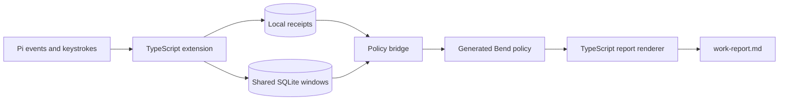

<div align="center">

# pi-time-tracker

**Working-hours tracking for Pi, reconciled by a verified Bend policy.**

_Keep local work receipts, reconcile overlapping activity, and review the hours._

<p>
  
</p>

[![checks][checks-badge]][checks]
[![Pi extension][pi-badge]](index.ts)
[![Bun 1.4.0][bun-badge]](.github/workflows/ci.yml)
[![License: MIT][license-badge]](LICENSE)

</div>

## Run

After [installing](#install) the extension, work is tracked automatically in the
project where the extension is loaded — no start or stop command is needed:

```text
/project set Coral   # optional: name this workspace's client once
/project report      # daily draft for this workspace
/project report all  # every workspace, from the shared database
```

Activity in the workspace's folder opens an inferred work window for its
client; quiet gaps up to a configurable limit join, and longer gaps stay
excluded and **Unknown**. Before labeling, windows use the workspace folder's
name as the client and `unlabeled` as the task. `/work start` and `/work stop`
remain an explicit, user-attested session clock; agent-turn receipts are recorded
separately. `/work report` includes all three measures. Workspace drafts go to
`exports/work-report.md`; `report all` writes `automatic-work-report.md` next to
the shared database. There is no web server, background service or external sync.

## Why pi-time-tracker?

Work can span several Pi turns and tabs. Adding their durations can double-count
an overlap, and a silent gap does not prove continuous work. This extension keeps
inspectable receipts and reconciles them without rewriting the original records.

| | Capability | What it unlocks |
| :-: | --- | --- |
| ⏱️ | **Automatic tracking** | Capture agent activity within a project and its real subdirectories. |
| 🗂️ | **Automatic work windows** | Infer elapsed working time from activity in a client's folder; no start/stop. |
| 💽 | **Built-in database** | One private SQLite store keeps clients, session tasks and work windows across reloads. |
| 🔀 | **Overlap reconciliation** | Count concurrent tabs once using the tested Bend interval union. |
| 🧾 | **Receipt auditing** | Surface missing evidence, duplicate receipts and conflicting summaries. |
| 💾 | **Event-driven checkpoints** | Retain interval evidence when a final turn summary is missing. |
| 📝 | **Work notes and session clock** | Record outcomes and explicit start/stop sessions separately. |
| 🔒 | **Local records** | Keep receipts in your project and windows in a local shared database; no external sync or automatic invoicing. |

## How it fits



[index.ts](index.ts) is the package entry point. [extension.ts](extension.ts)
owns Pi hooks, project scope and the command surfaces; [ledger.ts](ledger.ts)
owns receipt persistence and calendar boundaries; [project-store.ts](project-store.ts)
keeps workspace mappings and inferred work windows in one private SQLite
database, and [automatic.ts](automatic.ts) derives those windows from observed
activity. [native.ts](native.ts) validates numeric batches and runs the accounting
policy emitted from [engine.bend](engine.bend), [audit.bend](audit.bend) and
[batch.bend](batch.bend) into
[generated/policy.mjs](generated/policy.mjs). [report.ts](report.ts) renders the
results, while [activities.ts](activities.ts) validates outcome notes. There is no
parallel JavaScript implementation of interval union or receipt classification: the
generated module comes from the same Bend sources, and the opt-in native lane runs
those sources through the CLI instead.

## Install

You need Node.js >=22.19.0 (matching Pi 0.87.1's engine floor) and a
Pi 0.87.1-compatible host. Nothing else: the accounting policy ships as
[generated/policy.mjs](generated/policy.mjs), emitted at build time from the Bend
sources, so installing and running the tracker needs no compiler, no Clang and
no Bun.

The opt-in native lane exists to audit or validate that generated module. Set
`BEND_EXECUTABLE` or `WORKTIME_BEND_BINARY` and the tracker runs a real Bend build
instead. That lane needs [Bend][bend] plus a Clang version compatible with that
release, which you install yourself; the tracker never installs or upgrades your
compiler. Regenerating the generated policy needs them too (see
[Run from source](#run-from-source)).

CI tests Linux x64 with Bun 1.4.0, Node 22.19.0, Bend 2.0.31 and Clang 19. Bend
2.0.7 has also passed the suite locally; installation layouts differ between those
releases.

### Install the command

The `/work` commands come from this Pi extension, not a standalone application.
Prepare a checkout using [Run from source](#run-from-source), then run this from
**the project you want to track**:

```sh
pi install /absolute/path/to/pi-time-tracker --local
```

Replace the path with your checkout location. Alternatively, without cloning,
install the Git-hosted Pi package from the workspace you want to track:

```sh
pi install git:github.com/ryan-brosas/pi-time-tracker --local
```

For a reproducible Git install, append `@<commit-sha>` to the source. The
[published npm package](https://www.npmjs.com/package/pi-time-tracker) can also be
installed without cloning:

```sh
pi install npm:pi-time-tracker@0.1.0 --local
```

> `0.1.0` predates the generated policy and still compiles Bend on first use, so it
> needs Bend and Clang. The compiler-free default is unreleased: install from Git
> (above) or from a local checkout until the next version is published.

Approve project trust yourself and use `/reload` at an idle boundary. Load the package
only once: use its default entry point or a project-specific adapter, never both.

For a single project, you can instead add
`/absolute/path/to/pi-time-tracker/index.ts` to its `.pi/settings.json` extensions
list.

To track every client workspace with one shared database, install globally
instead. When switching, run these from the previously configured project:

```sh
pi remove /absolute/path/to/pi-time-tracker --local
pi install /absolute/path/to/pi-time-tracker
```

Remove any direct tracker entry or adapter from that project's extensions list
as well; repeat local removal in other configured projects. Use
`pi install git:github.com/ryan-brosas/pi-time-tracker` instead if you want a
global Git install; remove the old source first rather than loading both.
Equivalent package declarations are deduplicated by Pi, but distinct adapters
can still load the tracker twice. A `--local` install alone tracks only its
project's root.

### Run from source

```sh
git clone https://github.com/ryan-brosas/pi-time-tracker.git
cd pi-time-tracker
bun install --frozen-lockfile --ignore-scripts
bun run check
bun run test
bun run pack:check
```

`pack:check` verifies that the Pi manifest, every shipped runtime import, every Bend
source and the generated policy fit inside the package whitelist, and that tests,
proofs and build tooling stay out of the tarball. `bun run test` also checks that
`generated/policy.mjs` still matches its Bend sources. No compiler is needed to run
the tracker itself; the committed generated policy is what a Git or npm install uses.

Changing a `.bend` file means regenerating that artifact, which needs the pinned
toolchain. The installer verifies both pinned archives and lays the matching
compiler source beside the binary:

```sh
bash scripts/install-bend-ci.sh /absolute/toolchain/path
export BEND_EXECUTABLE=/absolute/toolchain/path/bin/bend
export BEND_SOURCE_DIR=/absolute/toolchain/path/source
bun run build:bend     # regenerate generated/policy.mjs
bun run build:check    # fail when the committed artifact is stale
bun run proof:check    # prove LAWS.bend and the gate's own negative controls
bun run pack:test      # pack the tarball and run it with no compiler on the Node floor
```

## Usage

These are Pi slash commands, not shell commands:

```text
/work start documentation
/work status
/work stop finished the README
/work time
/work report
```

| Command or tool | What it does |
| --- | --- |
| `/work start [label]` | Start an explicit session clock. |
| `/work stop [note]` | Close the session; its hours remain pending review. |
| `/work status` | Show whether a session is open. |
| `/work time` | Show the interval-union total, excluding legacy aggregates. |
| `/work report [YYYY-MM-DD]` | Write a daily report, optionally from a date onward. |
| `work_report` | Answer a question about tracked hours from recorded receipts and refresh the same draft. |
| `work_note` | Let the agent record a sanitized outcome and evidence status, without adding time. |

`work_report` and `work_note` are model-callable tools, not slash commands. Ask
how many hours you tracked in plain language and the agent calls `work_report`
and quotes the returned per-timezone summary instead of reading receipt logs or
recomputing totals. The tool measures recorded intervals only: days without
evidence stay Unknown, and the user-attested session clock, tracked agent-turn
hours and inferred automatic windows are never added together.

### How detailed is the report?

Timing evidence and narrative evidence are separate, and only one of them is
captured automatically:

- **Automatic:** per-turn intervals, their heuristic labels, session identity, capped
gaps and the automatic work windows per client and task.
- **Narrative:** a label, a one-line outcome, an evidence status (verified,
user-reported, draft, blocked or planned), optional links, and the turn or session
it belongs to — recorded only when `work_note` runs.

The tracker does not automatically capture prompts, transcripts or file contents.
Keep customer data and credentials out of explicitly supplied notes. A day with
no notes reports that no outcome notes were recorded instead of inventing detail.
The extension guides the agent to record milestones, but it cannot guarantee a
note for every turn and makes no model calls of its own.

### Automatic tracking and `/project`

Work is detected automatically. The folder or repo you opened Pi in maps to a
client workspace; optionally label it once and sessions — including resume and
`/reload` — inherit it. Without a label, the workspace folder's name is used:

```text
/project set Coral        # label this workspace's client, once
/project task invoices    # optional task for this Pi session
/project status           # client, task, policy and database path
/project report           # daily draft for this workspace
/project report 2025-01-15 # daily draft from this date onward
/project report all       # every workspace, from the shared database
```

- Work windows open on first observed activity — typed input, submitted
  prompts, agent turns and tool traffic — and stop advancing when activity stops.
- Quiet gaps up to `idleGapMs` (default 15 minutes) join into work; longer
  gaps are recorded separately and stay **Unknown**, never silently counted.
- An open session does not bill wall-clock lifetime: time advances only on
  observed activity, so an idle overnight session adds nothing.
- A backward system clock cannot invent time: prior windows stay exactly as
  recorded, capture restarts from a fresh zero-duration window at the observed
  timestamp, and no elapsed time is inferred across the jump.
- Windows carry the client and session task active when they happened; later
  renames never rewrite recorded rows.
- Concurrent sessions in one workspace overlap: reports count the interval
  union once, using the same Bend reconciliation as agent receipts.
- Keep one Pi process per saved session. Resuming one session file in two
  processes at once records overlapping raw window rows for that session;
  reports still count the union once, but review those rows before invoicing.
- A busy shared database no longer stops capture: the clock keeps the latest
  activity in memory, says so in the status line, and retries on the next
  event, report or session handover. Permanent storage failures still disable
  automatic tracking until the next session.
- Inferred elapsed work, agent-turn receipts and the manual `/work` session
  clock stay separate measures; never add the same time twice. Nothing
  outside Pi is observed, and hours are drafts until reviewed — no automatic
  invoicing.
- A storage failure disables automatic tracking for the current session and
  reports an error; the next session start retries. Missing activity is not
  reconstructed.

### Project configuration

By default, the tracker binds to Pi's initial context working directory, not the
package checkout or `process.cwd()`. It uses the `work` scope and your host's
local timezone. The root stays pinned for that loaded runtime; reload when
changing projects. Separate factory invocations keep independent state.

For an explicit project root, scope or timezone, use an adapter:

```ts
import { createTimeTrackingExtension } from "/path/to/pi-time-tracker/index.ts";

export default createTimeTrackingExtension("/path/to/project", {
  scopePrefix: "client",
  timezones: ["UTC"],
  legacyCommandNames: ["client-time"],
});
```

[TimeTrackingOptions](extension.ts) also exposes command names, storage paths,
the clock and native settings, plus `databasePath`, `idleGapMs` and
`projectCommand` for automatic tracking. An explicit `databasePath` must be
absolute. `projectCommand` is a nonempty token using letters, digits, `_` or `-`,
without a leading slash, and must not collide with another tracker command.
Factory options take precedence over executable, cache and database environment
defaults.

- `WORKTIME_DB_PATH` moves the shared SQLite database; `databasePath` wins.
  Without either override, it lives under `XDG_STATE_HOME` (default
  `~/.local/state`) at `pi-time-tracker/tracker.sqlite`.
- `BEND_EXECUTABLE` opts into the native lane and selects the compiler; without it
  the tracker runs `generated/policy.mjs`. Setting it alone compiles the engine on
  first use, so it also needs a compiler on `PATH`.
- `WORKTIME_BEND_BINARY` opts into the native lane with a trusted prebuilt engine
  instead of compiling.
- `XDG_CACHE_HOME` sets the cache base for a compiled engine, defaulting to
  `~/.cache`. The engine lives under `pi-worktime-native` and is unused by the
  generated default.

The corresponding factory options are `databasePath`, `bendExecutable`,
`nativeExecutable` and `cacheDir`. Any of `bendExecutable`, `nativeExecutable`,
`BEND_EXECUTABLE` or `WORKTIME_BEND_BINARY` selects the native lane; `cacheDir`
alone does not. A native failure is reported, never silently replaced by the
generated policy. Rebuild prebuilt engines after changing Bend policy. Build and
proof checks disable Bend telemetry and automatic updates; native compilation
disables telemetry.

### Local storage and privacy

Receipt, session, note and workspace-report files belong to the tracked project,
not the extension's checkout. By default, sessions started inside a Git repository
share its root `exports/` directory; without Git, the starting folder is used.
An explicitly configured adapter root still takes precedence. Existing receipts in
subfolder `exports/` directories are not moved or merged automatically; review
them before relying on a repo-root report:

| File under `exports/` | Contents |
| --- | --- |
| `pi-worktime.jsonl` | Per-turn summaries. |
| `pi-worktime-chunks.jsonl` | Counted intervals and checkpoint identity. |
| `work-sessions.jsonl` | Explicit session-clock events. |
| `work-activities.jsonl` | Timestamped outcome notes. |
| `work-report.md` | Generated working-hours draft. |

Automatic windows, workspace mappings and session tasks live in one shared
SQLite database, created with mode `0600`. Its default is
`~/.local/state/pi-time-tracker/tracker.sqlite`; see the environment overrides
above. It uses WAL, a five-second busy timeout and full synchronous writes so
several Pi processes can track concurrently; a symlinked database path is refused.
`/project report all` writes `automatic-work-report.md` next to the database,
independently of `reportFile`. It includes automatic windows across workspaces,
not repository-local agent receipts or manual session clocks.

Exclude the `exports/` files (also written with mode `0600`) from Git in every
tracked project. If the database is inside a repository, also ignore its exact
path, its `-wal`, `-shm` and `-journal` sidecars, and the sibling
`automatic-work-report.md`. Automatic capture does not persist prompts, tool
arguments or file contents. Keep credentials, customer data and private messages
out of free-text labels and notes. The `work_note` validator rejects common
credential and email patterns and query-bearing URLs; it is not complete
data-loss prevention.

Bend receives numeric IDs, timestamps, durations, counts and flags, not summary
text or labels. Its private temporary input files are removed after each command.
Source ledgers are not rewritten; malformed lines and missing or conflicting
evidence are disclosed in the report.

### Reading a report

- Session-clock hours, agent-turn activity and automatic work windows are separate
  views. Do not add the same time twice.
- Automatic windows are inferred elapsed time around observed activity. Excluded
  gaps longer than `idleGapMs` (default 15 minutes) stay **Unknown**; review them
  before invoicing.
- Agent-turn receipts exclude blocking prompt waits and cap silent gaps within
  a turn at five minutes. That cap is an estimate, not proof of uninterrupted
  work; it is separate from the automatic-window join limit.
- Missing coverage and open session ends stay **Unknown**. Work outside Pi and
  uncaptured time need separate evidence or confirmation.
- Labels are heuristic drafts. Per-label totals can overlap across concurrent
  sessions, even though the overall interval total is deduplicated.
- Notes never create duration. Their recording time does not establish an older
  artifact's publication time; unsupported activity duration stays Unallocated.
- Legacy aggregates are not added to interval totals. Conflicting summaries do
  not use last-writer-wins selection; independent interval evidence is retained.

Checkpoints help recover from interrupted processes. They are not backups or
power-loss guarantees. Review the report before using it in a timesheet or invoice.

## Documentation

- [Package entry point and factory](index.ts)
- [Project options and Pi integration](extension.ts)
- [Shared project store](project-store.ts)
- [Automatic-window derivation](automatic.ts)
- [Interval engine](engine.bend), [receipt audit](audit.bend) and [stack-safe batch helpers](batch.bend)
- [Native transport and cache](native.ts)
- [Draft label registry](labels.ts)
- [CI workflow](.github/workflows/ci.yml)
- [Security and private vulnerability reporting](SECURITY.md)
- [Report a bug][issues]

### Programmatic API

[index.ts](index.ts) intentionally exports these APIs for adapters and other
local consumers, in addition to its default Pi extension activation:

- `createTimeTrackingExtension` and `TimeTrackingOptions`: configure a tracker.
- `parseReportDay`: validate an optional report date, returning `null` when absent.
- `ProjectStore`, `Workspace` and `WorkWindow`: persist workspace clients, session
  tasks and timestamped work/gap evidence in SQLite.
- `defaultDatabasePath`: resolve the environment-aware database default.
- `repositoryRoot`: find the canonical repository root, or the input directory
  when no repository is found. `containsPath` checks lexical path containment;
  it does not resolve symlinks.
- `projectText`: validate and trim a nonempty, single-line client/task name of
  at most 120 characters.
- `AutomaticClock`, `DEFAULT_IDLE_GAP_MS` and `isHumanInput`: derive windows from
  observed activity and classify terminal input without storing its contents.
- `buildAutomaticReport` and `AutomaticReportOptions`: render automatic-window
  evidence as `{ text, summary }`, using the Bend accounting policy.

Each `ProjectStore` owns its own SQLite connection. Separate processes or
consumers may open the same database under WAL; writes serialize and may throw
if the five-second busy timeout expires. Callers own error handling and must
call `close()` on their own store, preferably in `finally`; do not close another
consumer's connection. An `AutomaticClock` borrows its store: call `flush()`
before closing it. Keep one clock owner per logical session/task and unique
window IDs rather than racing writers for the same evidence. Do not replace the
database, change its journal mode or remove live WAL/SHM files while any consumer
is open. SQLite owns WAL checkpointing; `flush()` persists clock evidence, not
an explicit WAL checkpoint.

### Development and contributions

Run `bun run check`, `bun run test` and `bun run pack:check` before proposing a change. The suite covers
interval properties, checkpoints, waits, project isolation, midnight/DST
boundaries, privacy, receipt replay/conflicts, malformed transport, imported-module
cache invalidation and real Pi registration. Its timeout allows cold compilation.

[CI][checks] runs the same gates on pushes to `main` and pull requests, using
read-only permissions and SHA-pinned Actions. Direct pushes to `main` are allowed;
CI reports the `quality` check after each push. [Dependabot](.github/dependabot.yml)
proposes weekly Action-pin updates; it does not merge them.

### Publishing a release

The [release workflow](.github/workflows/npm-publish.yml) is manual and runs only
from `main`. To release a version:

1. Bump `version` in `package.json` in a reviewed change and merge it to `main`.
   Already-published npm versions are immutable; the workflow rejects duplicates.
2. Run **Publish npm and GitHub release** from GitHub Actions, selecting `main`, or:
   `gh workflow run npm-publish.yml --repo ryan-brosas/pi-time-tracker --ref main`.
3. The workflow reruns the gates, packs once, tests that tarball without a compiler,
   and publishes it to npm with OIDC provenance. Only after npm succeeds does a
   separate job create `v<version>` at the tested commit and attach the same tarball
   to a [GitHub release](https://github.com/ryan-brosas/pi-time-tracker/releases).
   Generated notes use the categories in [.github/release.yml](.github/release.yml).

Stable versions use npm's `latest` tag and GitHub's Latest release. Versions with a
prerelease suffix use npm's `next` tag and a GitHub prerelease, not Latest. The npm
trusted publisher must name `ryan-brosas/pi-time-tracker` and `npm-publish.yml`,
with no environment. Never add a registry token to GitHub Actions. A Git push or
merge alone does not publish anything.

If npm succeeds but the GitHub release job fails, use **Re-run failed jobs** while
the verified artifact is retained (seven days). Do not rerun all jobs or republish
the npm version. Existing tags pointing to another commit and existing releases
are never overwritten; inspect and finish any partially created draft release
before retrying. npm publishing and GitHub release creation are not atomic.

The [CI installer](scripts/install-bend-ci.sh) verifies the SHA-256 of an exact
official Bend release and of the matching compiler source, then installs both into
a new explicitly supplied directory. It will not replace an existing compiler.
[scripts/bend-toolchain.json](scripts/bend-toolchain.json) owns the version,
revision and both digests; update it and run the full suite before changing the
pin. The released binary has no JavaScript emitter, which is why the source
archive is pinned too.

The generated module inlines the Bend `Base` definitions the policy uses, so it
ships with the Apache-2.0 attribution in
[THIRD_PARTY_NOTICES.md](THIRD_PARTY_NOTICES.md).

[LAWS.bend](LAWS.bend) states the receipt-classification obligations and
[PROOF.bend](PROOF.bend) proves them on the pinned compiler. `bun run proof:check`
also checks the gate itself: a broken policy must fail its law, and a law without
its proof must be rejected as an open claim. These laws cover receipt
classification only. Interval union is covered by the seeded discrete-coverage
oracle in `native.test.ts`, not by a universally quantified proof, and host
effects, the compiler and the generated module remain a trust boundary.

Keep Pi callbacks, filesystem access and timezone handling in the TypeScript
host. Put deterministic accounting policy in the side-effect-free Bend reducer,
not a per-event subprocess. Preserve or version the wire contracts; include all
local `.bend` modules in the cache key and test the actual compiled executable.
Build output rows and join once instead of repeatedly appending a growing string.

The bridge supports `worktime-v1` intervals and `worktime-audit-v1` receipts.
Numeric batches are limited to just under 8 MiB and fail explicitly when too
large. Unsupported interval markers and fractional milliseconds are rejected;
there is no silent JavaScript fallback. Receipt checks detect consistency
problems, not cryptographic tampering.

Use the [PR template](.github/pull_request_template.md) and synthetic reproductions.
Never attach real work ledgers, private reports or unredacted conversations to a
public issue or pull request.

### Prior art

[pi-ledger's receipt verification][prior-verifier] and its
[integrity tests][prior-tests], pinned at commit
`29cd1b0edd99727bac2cbb9b2003bebbb457c593`, informed the inspectable receipts and
explicit evidence states. Signing/key management and token-normalized billing
were not adopted. The native implementation and its regression tests establish
this tracker's behavior; the reference is not proof that this code works.

[varve][varve-repo] (Apache-2.0, Rust) inspired the local-first storage and
recovery posture of the automatic-window database: explicit checkpoint and
recovery boundaries, and refusing to write through ambiguous paths. Varve
itself was not adopted — `Database::open` takes an exclusive directory lock on
`<root>/LOCK` ([`src/engine.rs`][varve-lock]), which fits one Rust process but
not several concurrent Pi
processes sharing one store, so the embedded database here is SQLite in WAL
mode. No Varve code was copied.

> [!WARNING]
> This is an early project. Until the version you want is listed on npm,
> install the Pi package from Git. Working-hours reports are reviewable drafts,
> not a confirmed full-day timesheet or an automated billing decision.

## License

[MIT](LICENSE). Copyright © 2026 Ryan Brosas.

---

Powered by [Coral Bricks](https://coralbricks.ai).

[checks-badge]: https://img.shields.io/github/actions/workflow/status/ryan-brosas/pi-time-tracker/ci.yml?branch=main&style=for-the-badge&label=checks
[checks]: https://github.com/ryan-brosas/pi-time-tracker/actions/workflows/ci.yml
[pi-badge]: https://img.shields.io/badge/pi-extension-8b5cf6?style=for-the-badge
[bun-badge]: https://img.shields.io/badge/Bun-1.4.0-339933?style=for-the-badge&logo=bun&logoColor=white
[license-badge]: https://img.shields.io/badge/license-MIT-2ea44f?style=for-the-badge
[bend]: https://bend-lang.com/
[issues]: https://github.com/ryan-brosas/pi-time-tracker/issues
[prior-verifier]: https://github.com/inloopstudio-team/pi-ledger/blob/29cd1b0edd99727bac2cbb9b2003bebbb457c593/extensions/pi-ledger/index.ts#L966-L1015
[prior-tests]: https://github.com/inloopstudio-team/pi-ledger/blob/29cd1b0edd99727bac2cbb9b2003bebbb457c593/extensions/pi-ledger/__tests__/notarization.test.ts#L234-L281
[varve-repo]: https://github.com/monotykamary/varve/tree/4ce9bcc45d83bb7477f42248a1e64c7b1cc0b754
[varve-lock]: https://github.com/monotykamary/varve/blob/4ce9bcc45d83bb7477f42248a1e64c7b1cc0b754/src/engine.rs#L1106-L1113
