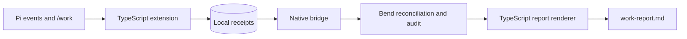

<div align="center">

# pi-time-tracker

**Working-hours tracking for Pi, reconciled in native Bend.**

_Keep local work receipts, reconcile overlapping activity, and review the hours._

<p>
  
</p>

[![checks][checks-badge]][checks]
[![Pi extension][pi-badge]](index.ts)
[![Bun 1.4.0][bun-badge]](.github/workflows/ci.yml)
[![License: UNLICENSED][license-badge]](#license)

</div>

## Run

After [installing](#install) the extension, run this inside your Pi session:

```text
/work report
```

Pi activity is tracked automatically in the project where the extension is
loaded. The command writes a daily working-hours draft to
`exports/work-report.md`; there is no web server or background service.

## Why pi-time-tracker?

Work can span several Pi turns and tabs. Adding their durations can double-count
an overlap, and a silent gap does not prove continuous work. This extension keeps
inspectable receipts and reconciles them without rewriting the original records.

| | Capability | What it unlocks |
| :-: | --- | --- |
| ⏱️ | **Automatic tracking** | Capture activity within a project and its real subdirectories. |
| 🔀 | **Overlap reconciliation** | Count concurrent tabs once using native Bend interval union. |
| 🧾 | **Receipt auditing** | Surface missing evidence, duplicate receipts and conflicting summaries. |
| 💾 | **Event-driven checkpoints** | Retain interval evidence when a final turn summary is missing. |
| 📝 | **Work notes and session clock** | Record outcomes and explicit start/stop sessions separately. |
| 🔒 | **Local records** | Keep work data in your project, with no external sync or automatic invoicing. |

## How it fits



[index.ts](index.ts) is the package entry point. [extension.ts](extension.ts)
owns Pi hooks and project scope; [ledger.ts](ledger.ts) owns persistence and
calendar boundaries. [native.ts](native.ts) sends numeric batches to
[engine.bend](engine.bend) and [audit.bend](audit.bend).
[report.ts](report.ts) renders the results, while [activities.ts](activities.ts)
validates outcome notes. There is no parallel JavaScript implementation of
interval union or receipt classification.

## Install

You need a Pi 0.87.1-compatible host, Bun, native Bend and a Clang version
compatible with that Bend release. Follow the [official Bend installation
instructions][bend]. The tracker never installs or upgrades your compiler.

CI tests Linux x64 with Bun 1.4.0, Bend 2.0.31 and Clang 19. Bend 2.0.7 has also
passed the suite locally; installation layouts differ between those releases.

### Install the command

The `/work` commands come from this Pi extension, not a standalone application.
Prepare a checkout using [Run from source](#run-from-source), then run this from
**the project you want to track**:

```sh
pi install /absolute/path/to/pi-time-tracker --local
```

Replace the path with your checkout location. Approve project trust yourself and
use `/reload` at an idle boundary. Load the package only once: use its default
entry point or a project-specific adapter, never both.

You can instead add `/absolute/path/to/pi-time-tracker/index.ts` to your project's
`.pi/settings.json` extensions list.

### Run from source

```sh
git clone https://github.com/ryan-brosas/pi-time-tracker.git
cd pi-time-tracker
bun install --frozen-lockfile --ignore-scripts
BEND_NO_TELEMETRY=1 bend --help
bun run check
bun run test
```

There is no separate JavaScript build step. The first data-bearing report or
reconciliation command compiles the native Bend engine if it is not cached.

## Usage

These are Pi slash commands, not shell commands:

```text
/work start documentation
/work status
/work stop finished the README
/work time
/work report
```

| Command or tool | What it does |
| --- | --- |
| `/work start [label]` | Start an explicit session clock. |
| `/work stop [note]` | Close the session; its hours remain pending review. |
| `/work status` | Show whether a session is open. |
| `/work time` | Show the native interval-union total, excluding legacy aggregates. |
| `/work report [YYYY-MM-DD]` | Write a daily report, optionally from a date onward. |
| `work_note` | Let the agent record a sanitized outcome and evidence status, without adding time. |

`work_note` is a model-callable tool, not a slash command. The extension guides
the agent to record completed milestones, but it cannot guarantee a note for
every turn. It makes no model calls of its own.

### Project configuration

By default, the tracker binds to Pi's initial context working directory, not the
package checkout or `process.cwd()`. It uses the `work` scope and your host's
local timezone. The root stays pinned for that loaded runtime; reload when
changing projects. Separate factory invocations keep independent state.

For an explicit project root, scope or timezone, use an adapter:

```ts
import { createTimeTrackingExtension } from "/path/to/pi-time-tracker/index.ts";

export default createTimeTrackingExtension("/path/to/project", {
  scopePrefix: "client",
  timezones: ["UTC"],
  legacyCommandNames: ["client-time"],
});
```

[TimeTrackingOptions](extension.ts) also exposes command names, storage paths,
the clock and native settings. Factory options take precedence over native
executable/cache environment defaults.

- `BEND_EXECUTABLE` selects the compiler; the default is `bend` on `PATH`.
- `WORKTIME_BEND_BINARY` selects a trusted prebuilt engine instead of compiling.
- `XDG_CACHE_HOME` sets the cache base, defaulting to `~/.cache`. The engine lives
  under `pi-worktime-native`.

The corresponding factory options are `bendExecutable`, `nativeExecutable` and
`cacheDir`. Rebuild prebuilt engines after changing Bend policy. Compiler calls
disable Bend telemetry and automatic updates.

### Local storage and privacy

Records belong to the tracked project, not the extension's checkout:

| File under `exports/` | Contents |
| --- | --- |
| `pi-worktime.jsonl` | Per-turn summaries. |
| `pi-worktime-chunks.jsonl` | Counted intervals and checkpoint identity. |
| `work-sessions.jsonl` | Explicit session-clock events. |
| `work-activities.jsonl` | Timestamped outcome notes. |
| `work-report.md` | Generated working-hours draft. |

Exclude these files from Git in every project where you enable tracking. They
are written with mode `0600`. Automatic capture does not persist prompts, tool
arguments or file contents. Keep credentials, customer data and private messages
out of free-text labels and notes. The `work_note` validator rejects common
credential and email patterns and query-bearing URLs; it is not complete
data-loss prevention.

Bend receives numeric IDs, timestamps, durations, counts and flags, not summary
text or labels. Its private temporary input files are removed after each command.
Source ledgers are not rewritten; malformed lines and missing or conflicting
evidence are disclosed in the report.

### Reading a report

- Session-clock hours and tracked activity are separate views. Do not add the
  same time twice.
- Blocking prompt waits are excluded. Silent gaps are capped at five minutes;
  that cap is an estimate, not proof of uninterrupted work.
- Missing coverage and open session ends stay **Unknown**. Work outside Pi and
  uncaptured time need separate evidence or confirmation.
- Labels are heuristic drafts. Per-label totals can overlap across concurrent
  sessions, even though the overall interval total is deduplicated.
- Notes never create duration. Their recording time does not establish an older
  artifact's publication time; unsupported activity duration stays Unallocated.
- Legacy aggregates are not added to interval totals. Conflicting summaries do
  not use last-writer-wins selection; independent interval evidence is retained.

Checkpoints help recover from interrupted processes. They are not backups or
power-loss guarantees. Review the report before using it in a timesheet or invoice.

## Documentation

- [Package entry point and factory](index.ts)
- [Project options and Pi integration](extension.ts)
- [Native interval engine](engine.bend) and [receipt audit](audit.bend)
- [Native transport and cache](native.ts)
- [Draft label registry](labels.ts)
- [CI workflow](.github/workflows/ci.yml)
- [Security and private vulnerability reporting](SECURITY.md)
- [Report a bug][issues]

### Development and contributions

Run `bun run check` and `bun run test` before proposing a change. The suite covers
interval properties, checkpoints, waits, project isolation, midnight/DST
boundaries, privacy, receipt replay/conflicts, malformed transport, imported-module
cache invalidation and real Pi registration. Its timeout allows cold compilation.

[CI][checks] runs the same gates on pushes to `main` and pull requests, using
read-only permissions and SHA-pinned Actions. Direct pushes to `main` are allowed;
CI reports the `quality` check after each push. [Dependabot](.github/dependabot.yml)
proposes weekly Action-pin updates; it does not merge them.

The [CI installer](scripts/install-bend-ci.sh) verifies the SHA-256 of an exact
official Bend release and installs into a new explicitly supplied directory.
It will not replace an existing compiler. Update its version and digest together
and run the full suite before changing the pin.

Keep Pi callbacks, filesystem access and timezone handling in the TypeScript
host. Put deterministic accounting policy in the side-effect-free Bend reducer,
not a per-event subprocess. Preserve or version the wire contracts; include all
local `.bend` modules in the cache key and test the actual compiled executable.
Build output rows and join once instead of repeatedly appending a growing string.

The bridge supports `worktime-v1` intervals and `worktime-audit-v1` receipts.
Numeric batches are limited to just under 8 MiB and fail explicitly when too
large. Unsupported interval markers and fractional milliseconds are rejected;
there is no silent JavaScript fallback. Receipt checks detect consistency
problems, not cryptographic tampering.

Use the [PR template](.github/pull_request_template.md) and synthetic reproductions.
Never attach real work ledgers, private reports or unredacted conversations to a
public issue or pull request.

### Prior art

[pi-ledger's receipt verification][prior-verifier] and its
[integrity tests][prior-tests], pinned at commit
`29cd1b0edd99727bac2cbb9b2003bebbb457c593`, informed the inspectable receipts and
explicit evidence states. Signing/key management and token-normalized billing
were not adopted. The native implementation and its regression tests establish
this tracker's behavior; the reference is not proof that this code works.

> [!WARNING]
> This is an early project with no published npm release. Working-hours reports
> are reviewable drafts, not a confirmed full-day timesheet or an automated
> billing decision.

## License

**UNLICENSED.** No open-source license has been selected. Public visibility does
not grant an open-source reuse license. The package remains `private: true` to
prevent accidental npm publication.

[checks-badge]: https://img.shields.io/github/actions/workflow/status/ryan-brosas/pi-time-tracker/ci.yml?branch=main&style=for-the-badge&label=checks
[checks]: https://github.com/ryan-brosas/pi-time-tracker/actions/workflows/ci.yml
[pi-badge]: https://img.shields.io/badge/pi-extension-8b5cf6?style=for-the-badge
[bun-badge]: https://img.shields.io/badge/Bun-1.4.0-339933?style=for-the-badge&logo=bun&logoColor=white
[license-badge]: https://img.shields.io/badge/license-UNLICENSED-f4c430?style=for-the-badge
[bend]: https://bend-lang.com/
[issues]: https://github.com/ryan-brosas/pi-time-tracker/issues
[prior-verifier]: https://github.com/inloopstudio-team/pi-ledger/blob/29cd1b0edd99727bac2cbb9b2003bebbb457c593/extensions/pi-ledger/index.ts#L966-L1015
[prior-tests]: https://github.com/inloopstudio-team/pi-ledger/blob/29cd1b0edd99727bac2cbb9b2003bebbb457c593/extensions/pi-ledger/__tests__/notarization.test.ts#L234-L281
