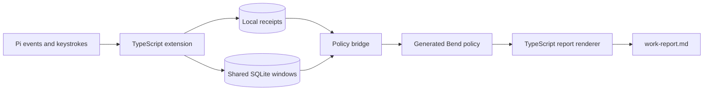

# Development

For installation and a quick start, see the [README](../README.md).

CI tests Linux x64 with Bun 1.4.0, Node 22.19.0, Bend 2.0.31 and Clang 19.
The pinned toolchain is needed for development checks, not normal package use.

## How it fits



[index.ts](../index.ts) is the package entry point. [extension.ts](../extension.ts)
owns Pi hooks, project scope and the command surfaces; [ledger.ts](../ledger.ts)
owns receipt persistence and calendar boundaries; [project-store.ts](../project-store.ts)
keeps workspace mappings and inferred work windows in one private SQLite
database, and [automatic.ts](../automatic.ts) derives those windows from observed
activity. [native.ts](../native.ts) validates numeric batches and runs the accounting
policy emitted from [engine.bend](../engine.bend), [audit.bend](../audit.bend) and
[batch.bend](../batch.bend) into
[generated/policy.mjs](../generated/policy.mjs). [report.ts](../report.ts) renders the
results, while [activities.ts](../activities.ts) validates outcome notes. There is no
parallel JavaScript implementation of interval union or receipt classification: the
generated module comes from the same Bend sources, and the opt-in native lane runs
those sources through the CLI instead.

## Run from source

```sh
git clone https://github.com/ryan-brosas/pi-time-tracker.git
cd pi-time-tracker
bun install --frozen-lockfile --ignore-scripts
bun run check
bun run test
bun run pack:check
```

`pack:check` verifies that the Pi manifest, every shipped runtime import, every Bend
source and the generated policy fit inside the package whitelist, and that tests,
proofs and build tooling stay out of the tarball. With the pinned toolchain installed,
`bun run test` also checks that `generated/policy.mjs` still matches its Bend sources.
No compiler is needed to run the tracker itself; Git installs and npm packages
from `0.2.0` include the generated policy.

Changing a `.bend` file means regenerating that artifact, which needs the pinned
toolchain. The installer verifies both pinned archives and lays the matching
compiler source beside the binary:

```sh
bash scripts/install-bend-ci.sh /absolute/toolchain/path
export BEND_EXECUTABLE=/absolute/toolchain/path/bin/bend
export BEND_SOURCE_DIR=/absolute/toolchain/path/source
bun run build:bend     # regenerate generated/policy.mjs
bun run build:check    # fail when the committed artifact is stale
bun run proof:check    # prove LAWS.bend and the gate's own negative controls
bun run pack:test      # pack the tarball and run it with no compiler on the Node floor
```

## Load a local checkout

After preparing the checkout, run this from the project you want to track:

```sh
pi install /absolute/path/to/pi-time-tracker --local
```

Omit `--local` to load it across workspaces. Remove any existing npm or Git install
of the tracker first, using `pi remove` with that source and the same scope.
Approve project trust yourself, then use `/reload` in Pi at an idle boundary.
Do not load the default entry point alongside a project-specific adapter.

## Programmatic API

[index.ts](../index.ts) intentionally exports these APIs for adapters and other
local consumers, in addition to its default Pi extension activation:

- `createTimeTrackingExtension` and `TimeTrackingOptions`: configure a tracker.
- `parseReportDay`: validate an optional report date, returning `null` when absent.
- `ProjectStore`, `Workspace` and `WorkWindow`: persist workspace clients, session
  tasks and timestamped work/gap evidence in SQLite.
- `defaultDatabasePath`: resolve the environment-aware database default.
- `repositoryRoot`: find the canonical repository root, or the input directory
  when no repository is found. `containsPath` checks lexical path containment;
  it does not resolve symlinks.
- `projectText`: validate and trim a nonempty, single-line client/task name of
  at most 120 characters.
- `AutomaticClock`, `DEFAULT_IDLE_GAP_MS` and `isHumanInput`: derive windows from
  observed activity and classify terminal input without storing its contents.
- `buildAutomaticReport` and `AutomaticReportOptions`: render automatic-window
  evidence as `{ text, summary }`, using the Bend accounting policy.

Each `ProjectStore` owns its own SQLite connection. Separate processes or
consumers may open the same database under WAL; writes serialize and may throw
if the five-second busy timeout expires. Callers own error handling and must
call `close()` on their own store, preferably in `finally`; do not close another
consumer's connection. An `AutomaticClock` borrows its store: call `flush()`
before closing it. Keep one clock owner per logical session/task and unique
window IDs rather than racing writers for the same evidence. Do not replace the
database, change its journal mode or remove live WAL/SHM files while any consumer
is open. SQLite owns WAL checkpointing; `flush()` persists clock evidence, not
an explicit WAL checkpoint.

## Development and contributions

Run `bun run check`, `bun run test` and `bun run pack:check` before proposing a change. The suite covers
interval properties, checkpoints, waits, project isolation, midnight/DST
boundaries, privacy, receipt replay/conflicts, malformed transport, imported-module
cache invalidation and real Pi registration. Its timeout allows cold compilation.

[CI][checks] runs the same gates on pushes to `main` and pull requests, using
read-only permissions and SHA-pinned Actions. Direct pushes to `main` are allowed;
CI reports the `quality` check after each push. [Dependabot](../.github/dependabot.yml)
proposes weekly Action-pin updates; it does not merge them.

## Publishing a release

The [release workflow](../.github/workflows/npm-publish.yml) runs for every push to
`main`; publishing happens there and nowhere else. Running it manually on `main`
(`gh workflow run npm-publish.yml --repo ryan-brosas/pi-time-tracker --ref main`)
is only a retry for a commit that has not been released yet.

1. A read-only `plan` job decides whether the pushed commit needs a release and
   which version it ships, reading published versions from npm and release tags
   from Git. It fails closed when that state is unreadable, and it never writes to
   the checkout, the registry or GitHub.
2. The `publish` job stamps the generated version and the source commit into the
   package, reruns the gates, packs once, tests that tarball without a compiler,
   and publishes it to npm with OIDC provenance.
3. Only after npm succeeds does a separate job create `v<version>` at the tested
   commit and attach the same tarball to a
   [GitHub release](https://github.com/ryan-brosas/pi-time-tracker/releases).
   Generated notes use the categories in [.github/release.yml](../.github/release.yml).

Versions are generated in CI and never committed back to `main`. The repository's
`package.json` holds the release baseline, while the published manifest carries the
released version and a `gitHead` naming the exact source commit. Keep the baseline
at the major/minor line you are shipping, so ordinary fixes need no version edit:
a baseline newer than every published release is released as declared — that is how
a minor or major release is cut — and a baseline with a prerelease suffix stays on
npm's `next` tag. Otherwise the next patch is generated automatically (`0.2.0`,
`0.2.1`, `0.2.2`, …). Already-published versions are immutable: a commit that is
already released, or older than the newest release, skips rather than republishing.

Releases are serialized (`concurrency: queue: max`, up to 100 waiting runs) and a
running release is never cancelled, so two pushes cannot publish out of order.
Stable versions use npm's `latest` tag and GitHub's Latest release. Versions with a
prerelease suffix use npm's `next` tag and a GitHub prerelease, not Latest. The npm
trusted publisher must name `ryan-brosas/pi-time-tracker` and `npm-publish.yml`,
with no environment. Never add a registry token to GitHub Actions.

npm makes a successful publish readable a few minutes after the run, so a missing
version immediately after a green run is expected. If npm succeeds but the GitHub
release job fails, do not rerun all jobs or republish the npm version. While the
verified artifact is retained (seven days), either finish a partially created draft
release manually using that artifact, or delete the draft and **Re-run failed jobs**
to let the workflow create a clean release. Existing tags pointing to another commit
and existing releases are never overwritten. npm publishing and GitHub release
creation are not atomic.

## Toolchain pinning and proofs

The [CI installer](../scripts/install-bend-ci.sh) verifies the SHA-256 of an exact
official Bend release and of the matching compiler source, then installs both into
a new explicitly supplied directory. It will not replace an existing compiler.
[scripts/bend-toolchain.json](../scripts/bend-toolchain.json) owns the version,
revision and both digests; update it and run the full suite before changing the
pin. The released binary has no JavaScript emitter, which is why the source
archive is pinned too.

The generated module inlines the Bend `Base` definitions the policy uses, so it
ships with the Apache-2.0 attribution in
[THIRD_PARTY_NOTICES.md](../THIRD_PARTY_NOTICES.md).

[LAWS.bend](../LAWS.bend) states the receipt-classification obligations and
[PROOF.bend](../PROOF.bend) proves them on the pinned compiler. `bun run proof:check`
also checks the gate itself: a broken policy must fail its law, and a law without
its proof must be rejected as an open claim. These laws cover receipt
classification only. Interval union is covered by the seeded discrete-coverage
oracle in `native.test.ts`, not by a universally quantified proof, and host
effects, the compiler and the generated module remain a trust boundary.

Keep Pi callbacks, filesystem access and timezone handling in the TypeScript
host. Put deterministic accounting policy in the side-effect-free Bend reducer,
not a per-event subprocess. Preserve or version the wire contracts; include all
local `.bend` modules in the cache key and test the actual compiled executable.
Build output rows and join once instead of repeatedly appending a growing string.

The bridge supports `worktime-v1` intervals and `worktime-audit-v1` receipts.
Numeric batches are limited to just under 8 MiB and fail explicitly when too
large. Unsupported interval markers and fractional milliseconds are rejected;
there is no silent JavaScript fallback. Receipt checks detect consistency
problems, not cryptographic tampering.

Use the [PR template](../.github/pull_request_template.md) and synthetic reproductions.
Never attach real work ledgers, private reports or unredacted conversations to a
public issue or pull request.

## Prior art

[pi-ledger's receipt verification][prior-verifier] and its
[integrity tests][prior-tests], pinned at commit
`29cd1b0edd99727bac2cbb9b2003bebbb457c593`, informed the inspectable receipts and
explicit evidence states. Signing/key management and token-normalized billing
were not adopted. The native implementation and its regression tests establish
this tracker's behavior; the reference is not proof that this code works.

[varve][varve-repo] (Apache-2.0, Rust) inspired the local-first storage and
recovery posture of the automatic-window database: explicit checkpoint and
recovery boundaries, and refusing to write through ambiguous paths. Varve
itself was not adopted — `Database::open` takes an exclusive directory lock on
`<root>/LOCK` ([`src/engine.rs`][varve-lock]), which fits one Rust process but
not several concurrent Pi
processes sharing one store, so the embedded database here is SQLite in WAL
mode. No Varve code was copied.

[checks]: https://github.com/ryan-brosas/pi-time-tracker/actions/workflows/ci.yml
[prior-verifier]: https://github.com/inloopstudio-team/pi-ledger/blob/29cd1b0edd99727bac2cbb9b2003bebbb457c593/extensions/pi-ledger/index.ts#L966-L1015
[prior-tests]: https://github.com/inloopstudio-team/pi-ledger/blob/29cd1b0edd99727bac2cbb9b2003bebbb457c593/extensions/pi-ledger/__tests__/notarization.test.ts#L234-L281
[varve-repo]: https://github.com/monotykamary/varve/tree/4ce9bcc45d83bb7477f42248a1e64c7b1cc0b754
[varve-lock]: https://github.com/monotykamary/varve/blob/4ce9bcc45d83bb7477f42248a1e64c7b1cc0b754/src/engine.rs#L1106-L1113
